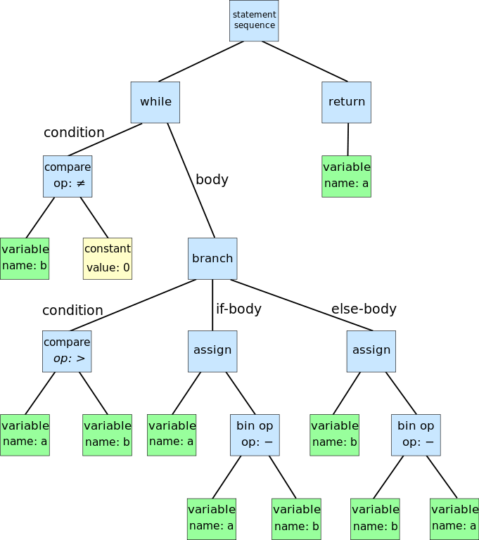
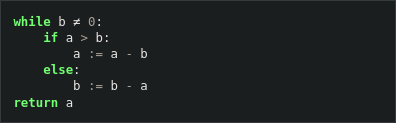

<!-- _class: front -->

# Árvores Binária de Busca

## Algoritmos e Estruturas de Dados

--------

<!-- _class: front -->
# Árvores estão em todo lugar!

------------

Fonte: https://commons.wikimedia.org/wiki/File:Abstract_syntax_tree_for_Euclidean_algorithm.svg

----------

Fonte: https://scikit-learn.org/stable/auto_examples/tree/plot_iris_dtc.html

----------

Fonte: https://www.geeksforgeeks.org/search-algorithms-in-ai/

-----------

# Árvores

Todos exemplos tem algumas características em comum:

- existe um nó especial chamado *raiz*, que é por onde começamos a analisar a árvore
- a distância de um nó até a raiz é chamada de *altura do nó*
- todo nó tem somente um predecessor direto, que é chamado de *pai*
- não há ciclos nem arestas entre nós de diferentes alturas

### Representa ideias de hierarquia e ordenação

----------------

Fonte: https://www.geeksforgeeks.org/introduction-to-tree-data-structure-and-algorithm-tutorials/

------------------

# Árvores de Busca Binária

Representam uma das seguintes ideias: 

- conjunto (ordenado)
- array associativo (ordenado)
- coleção de dados que precise ser mantida ordenada 

---------

-----

# Árvores de Busca Binária

Dado um nó $x$ de nossa árvore, 

- $x.left$ é o filho esquerdo de $x$. Se ele não existir seu valor é $NIL$
- $x.right$ é o filho direito de $x$. Se ele não existir seu valor é $NIL$
- $x.key$ é o valor que $x$ representa na árvore. 

------

# Propriedade básica da ABB

Para todo nó $x$ em uma *ABB*:

- $x.key \geq l.key$ para todo nó $l$ na subárvore esquerda de $x$
- $x.key \leq r.key$ para todo nó $r$ na subárvore direita de $x$

-----

# Operação Busca (query)

------

# Validação 

Quais são os valores possíveis para o nó "*????*" ?

------

# Validação 

Todo nó deve obedecer a propriedade básica!

----

# Hoje + próxima aula

- Leitura do Handout
- Exercícios básicos no handout
- Busca e validação no PrairieLearn

**Sugestão**: fazer todos os exercícios conceituais hoje e deixar código para a próxima aula

